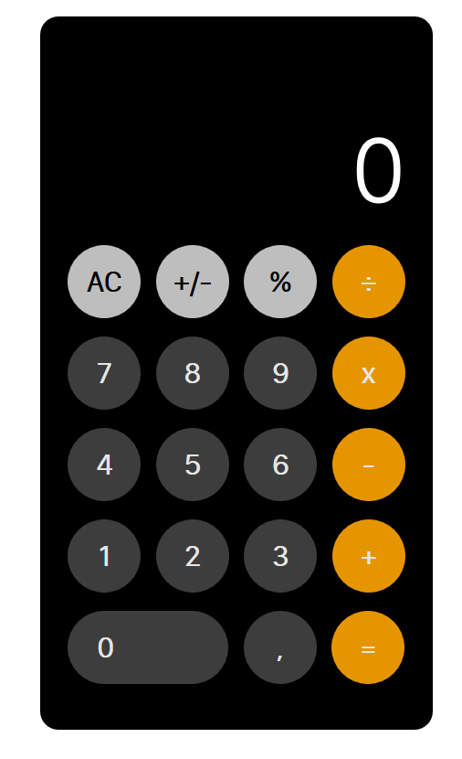

# ios-calculator-for-web
This is a calculator for the web following the design of the iOS-Calculator.

# Getting Started
Install the package via `npm` or `yarn` and deliver the script to the user.
This can be done via `import`, `require` or just inserting a `script` tag.

```shell
npm i ios-calculator-for-web
```
```shell
yarn add ios-calculator-for-web
```

# Usage
Just add this HTML-Snippet in your code and wrap it into any kind of container.
```html
<ios-calculator></ios-calculator>
```

# Example
Can also take a look at the [demo.html](demo.html) to get an interactive example.
