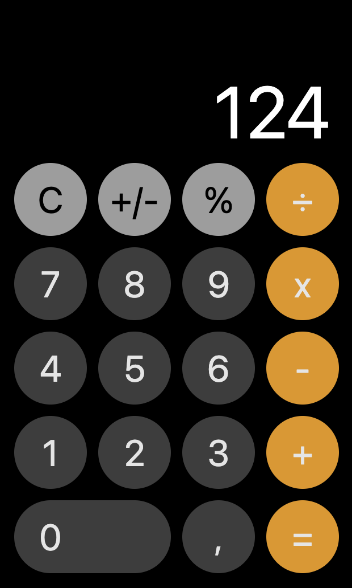

# ios-calculator-for-web
This is a calculator for the web following the design of the iOS-Calculator.

# Getting Started
All you have to do is deliver everything in the dist/ folder to the user. Either by installing the npm package in your project or by cloning this repo into your project.

```shell
npm i ios-calculator-for-web
```

# Usage
Just add this HTML-Snippet in your code and wrap it into any kind of container.
```html
<div class="ios-calculator"></div>
```

# Example
